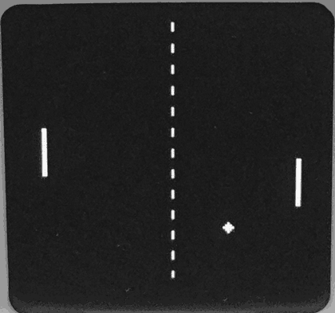

# Embedded Display Idle Animations

A collection of original standby animations for small embedded displays. Each animation folder is an AI handoff pack for people who already have their own device firmware and want to add an animation without replacing their existing features. Give the folder and your project to an AI coding assistant to adapt the animation to your display and integrate it into your existing idle flow.

Animations may target different display technologies and sizes, but are not automatically compatible with every screen. Each folder states its tested hardware and assumptions.

## Animation folders

- [`animations/pong/`](animations/pong/) — original silent AI-versus-AI Pong animation, with an animation-only source excerpt and instructions to preserve the user's existing project behavior. Its original target is Kira with a 128 x 128 monochrome SH1107 OLED.

Compiled firmware and one-click installers are optional future additions. The per-animation source folder is the main deliverable.
